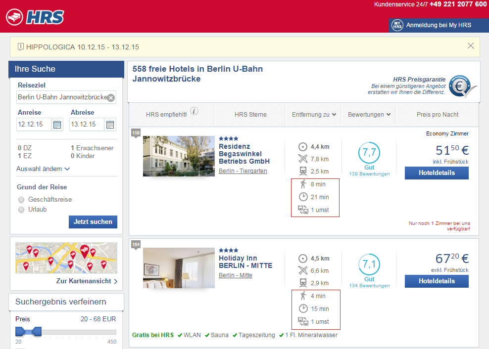
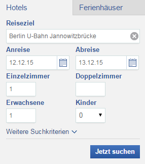
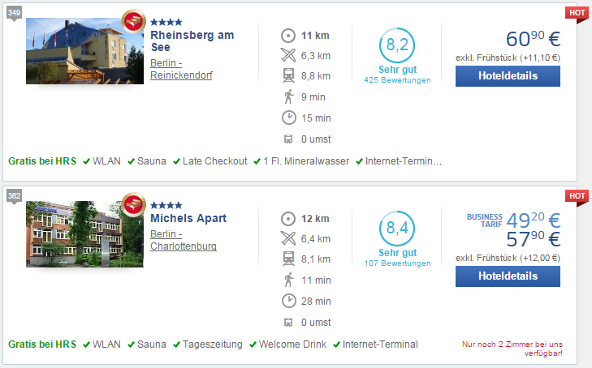

# HotelRoute

HotelRoute is a Google Chrome extension which helps you to find hotels with the best public transport connection to your destination.

This allows you to save time, money, reduce travel stress and get better hotel quality for price.

HotelRoute was developed by [Thomas Tursics](http://github.com/tursics) and [Alexey Valikov](http://github.com/highsource) as the [DB Hackathon 3](https://www.mindboxberlin.com/index.php/3rdhackathon.html) project and should be considered a prototype or a proof-of-concept implementation.

# Status

The [HotelRoute back-end](http://api.hotelroute.org/index.html) uses [bahn.de](http://bahn.de) to search for connections.  
**Requests from HotelRoute are very often blocked by [bahn.de](http://bahn.de) due to the error:**

> Our booking system is currently being used by too many users at the same time.  

**This happens even more frequently, when several users access HotelRoute at the same time.**

In case of errors, public transport connection information **will not be added to many or most of the hotels in your search results**.

Please consider that at the moment HotelRoute is just a proof-of-concept which pushes the boundaries of existing systems and therefor breaks very often.

# What it does

HotelRoute extends hotel search results of [hrs.de](http://www.hrs.de) and adds information on public transport connection between the found hotels and the travel destination:

HotelRoute adds the following information:

*  - walking time to the next public transport stop
*  - duration of the trip with public transport to your destination (in minutes)
*  - how many times do you have to change during the trip

# Disclaimer

**The accuracy of the provided information is in no way guaranteed. We overtake no responsibility for the correctness of results.**

# How it helps

When you search for hotels on portals like [hrs.de](http://www.hrs.de), [hotel.com](http://www.hotel.com) or [booking.com](http://www.booking.com),
search results typically contain distance to your destination in kilometers or miles.

If you prefer using public transport, distance in kilometers does not help you that much.
Depending on the location of your hotel and your travel destination, 10 kilometers may take you 10 minutes or over an hour.
This may be a direct connection or you may need to change transport means a couple of times.

All of this makes a great difference in terms of time and stress, and ultimately has great influence on yoru travel experience.

HotelRoute checks each of the found hotels for the quality of the public transport connection to you travel destination and displays this information directly in the search results.

This helps you to:

* save time by travelling less,
* save money by avoiding expensive central hotels,
* get better hotel quality (more hotel stars) for the price in offside, but still well connected hotels.

# How to use it

* Download and install the Google Chrome extension from [Releases](https://github.com/highsource/hotelroute/releases)
* Go to [hrs.de](http://www.hrs.de/) and search for hotels for a travel destination in Germany:  

* See the connection information in results:  

* Choose the hotel which suits you best

# Limitations

* In some cases the location of the hotel can't be be unambiguously determined based on its address.  
This means that results may be inaccurate and/or misleading.
* HotelRoute uses [bahn.de](http://bahn.de) to find the shortest trip between each of the hotels and your travel destination.  
This means HotelRoute mostly works only for German destinations.
* HotelRoute uses "unofficial" APIs for [bahn.de](http://bahn.de), accesses and modifies [hrs.de](http://www.hrs.de) pages directly.  
This means HotelRoute may cease working or break any moment of time without notice.
* HotelRoute is primarily a prototype with the goal to demostrate integration of [bahn.de](http://bahn.de) with external applications.  
HotelRoute may be discontinued or shut down any moment of time.
* HotelRoute searches for the shortest trip between the address of the hotel and your travel destination at ca. 09:00 of the first or the second day of the stay (the latter in case current time is already later than 09:00 of the first day of the stay).  
In certain cases (public holidays etc.) these results may be not representative.

# Privacy

* HotelRoute accesses travel destination, arrival and departure dates and the results of your search.
* This information is transmitted to the [api.hotelroute.org](http://api.hotelroute.org) and indirectly to [bahn.de](http://bahn.de). It is neither stored nor transmitted to any other parties.
* Currently we use the `HTTP` protocol to transfer data. This means that third parties may potentially get access to the transferred data.

# Contact

* [Alexey Valikov](https://www.xing.com/profile/Aleksei_Valikov)
* [Thomas Tursics](https://www.xing.com/profile/Thomas_Tursics)
